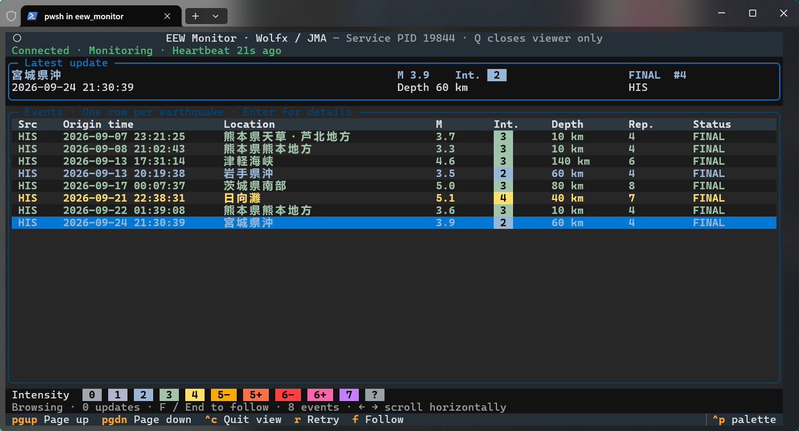

# EEW Monitor
> This software was built assisted with `gpt-5.6-sol`/`gpt-6-astra` using Codex.

This is an [EEW](https://en.wikipedia.org/wiki/Earthquake_Early_Warning_(Japan)) (Earthquake Early Warning) software that pops warning info on your desktop & records them once an EEW message announces.




## Features

- **Receiver** (service)
  - Receives EEW updates in the background (with WebSocket)
    - Currently supoorts [JMA](https://www.data.jma.go.jp/multi/quake/index.html) (Japan Meteorological Agency, 気象庁) only (credit to [Wolfx API](https://wolfx.jp/apidoc_en));
    - Plan to support: [CENC](https://data.earthquake.cn/) (China Earthquake Networks Center, 国家地震科学数据中心) and more.
  - Once received alert messages:
    - Record files in json format, same file will be updated if the alert has been updated;
    - Pop-up window at the corner on desktop.
  - Quitting TUI does not stop the receiver.
- **Interactive TUI**
  - Structural info messages display and updates as a table;
  - Both history and live messages;
  - Changeable themes and color schemes (will be added a bit later).
- **Compatibility**
  - Supposed to work on both Windows and Linux.


## Requirements

``` bash
python -m pip install -r requirements.txt
```

- Python 3.9+
- packages
  - `websockets==16.1.1`
  - `win11toast==0.36.3; sys_platform == "win32"`
  - `textual==8.2.8`

## To Run

- TUI (by default)

  ``` bash
  python eew.py 
  ```

  Major controls are shown on the TUI.

  `Ctrl + C` / `Q` only close the TUI window and does not stop the background receiving service, please use `python eew_service.py stop` to actually stop the program.

- Background receiver (service): double-click `eew_background.pyw` on Windows, or with commands: 

  ``` bash
  python eew_service.py start   
  python eew_service.py status  
  python eew_service.py retry
  python eew_service.py stop
  ```

- Keep Monitor when Start Up (Windows)

  Use `win + R` and type in `shell:startup` to open the startup folder. Then simply add the shortcut (`.lnk`) of `eew_background.pyw`.

## Misc

### Color 

Colors reflect the maximum intensity (Shindo, based on JMA's system) and I referred [JQuake](https://jquake.net/)'s color scheme. The default color scheme is set to `MUTED (Soft)`.

| Intensity | JQUAKE                 | MUTED (Soft)             |
| --------- | ---------------------- | ------------------------ |
| 0         | `#3c3c3c`              | Light Gray (`#a3a8b0`)   |
| 1         | Light Gray (`#6e7878`) | Soft Gray (`#b2b5cc`)    |
| 2         | Blue (`#1e6ef0`)       | Blue-Gray (`#96b7d8`)    |
| 3         | Green (`#32b464`)      | Light Green (`#9fc4aa`)  |
| 4         | Yellow (`#ffe05d`)     | Yellow (`#ffe066`)       |
| 5-        | Orange (`#ffaa00`)     | Orange (`#ffaa00`)       |
| 5+        | Orange-Red (`#fa7800`) | Orange-Red (`#ff7043`)   |
| 6-        | Red (`#f00000`)        | Red (`#ff4040`)          |
| 6+        | Dark-Red (`#a00000`)   | Pink (`#ff66aa`)         |
| 7         | Purple (`#800080`)     | Purple (`#c77dff`)       |
| Unknown   | --                     | Neutral Gray (`#9aa0a6`) |

### Threshold

Earthquake with maximum intensity `>= 4` or magnitude `>= 5.0` would be alerted with a desktop notification, regardless final or not.


## Todo

- [x] Main program 
  - [x] Base Functions: Websocket receiver + Data process + Pop-up alert
  - [x] Refactoring: TUI (interactive event list) + background receiver service
  - [x] Color schemes & int. thresholds, will be adjusted as well
- [ ] Data:
  - [x] 1st phase: JMA (Japan)
  - [ ] 2nd phase: CENC (China), etc.
- [ ] Maybe future: 
  - [ ] Add an icon;
  - [ ] Add sound? 
  - [ ] Add an ASCII diagram in TUI (maybe add a diagram displayed in TUI - detailed info - to show the approx place);
  - [x] Changeable color themes (WIP)
  - [ ] ...
